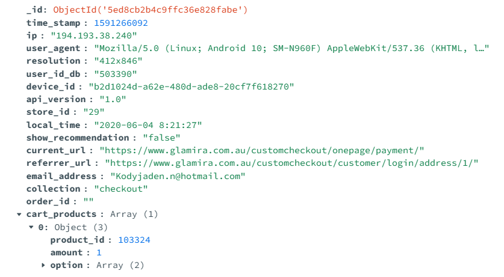
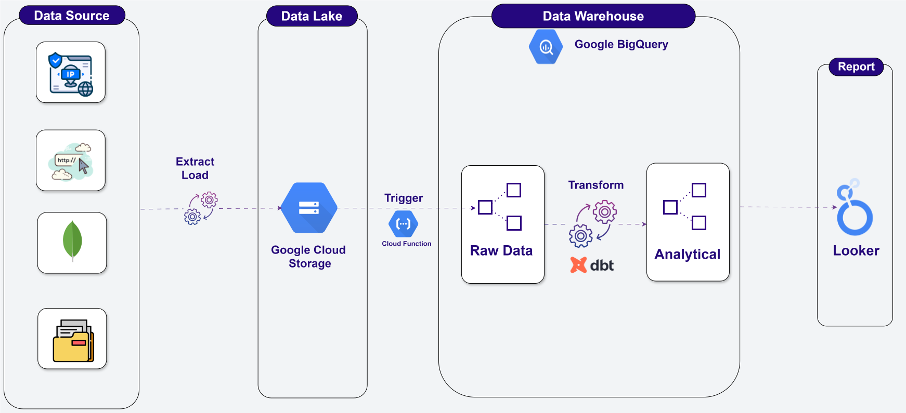
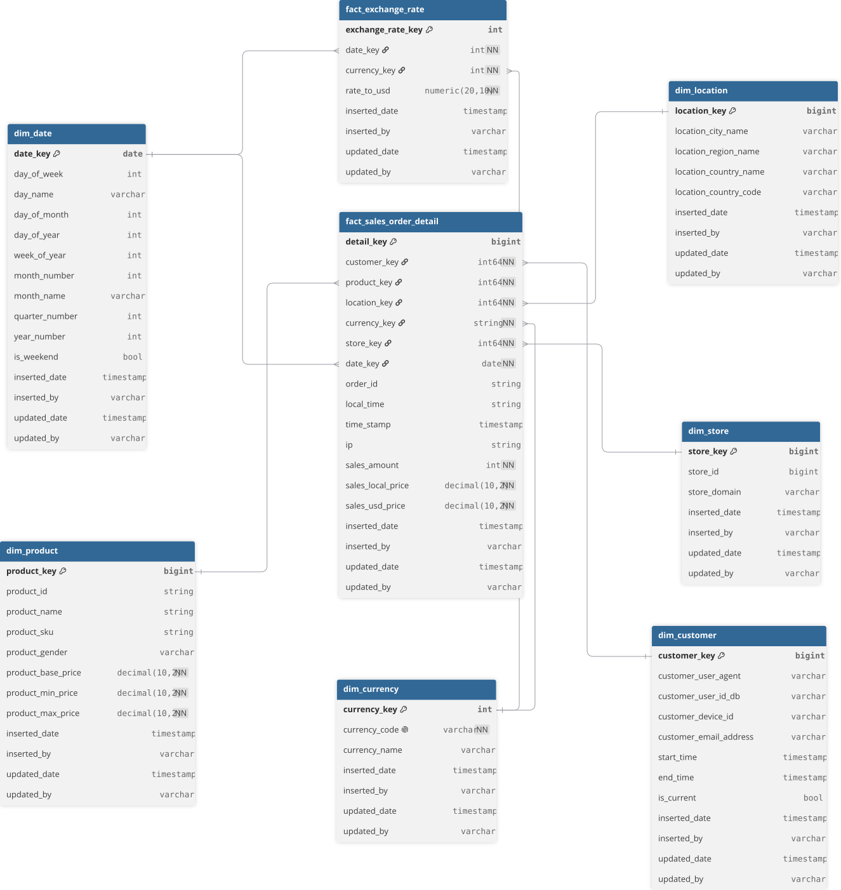
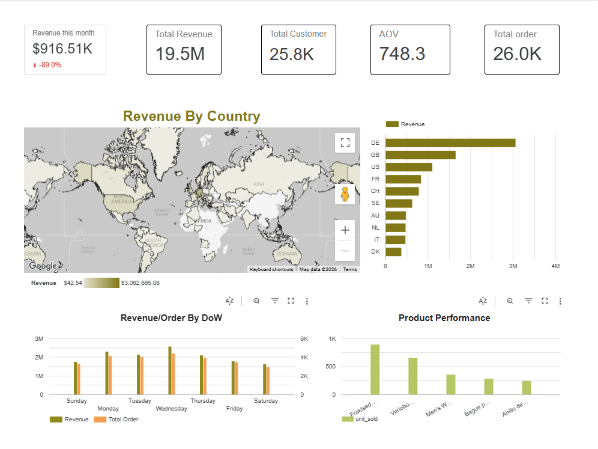
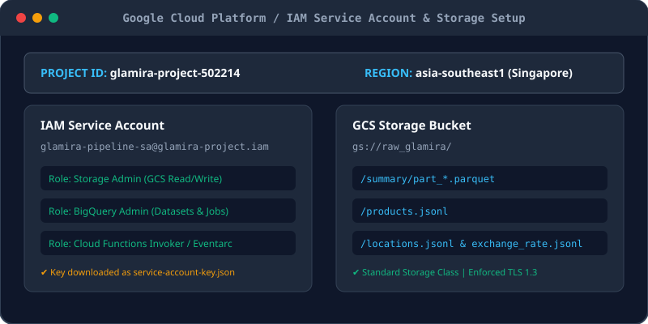
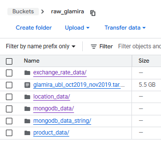
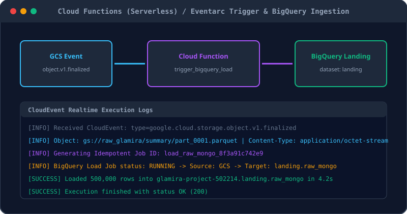
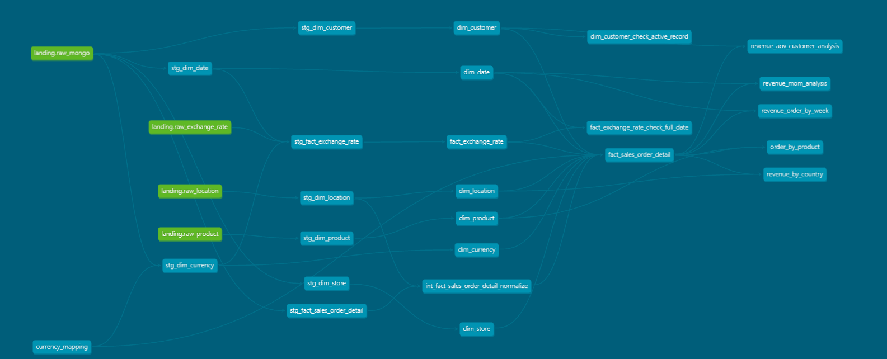
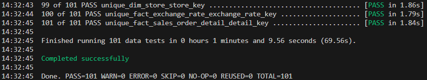

# Glamira Analytics Pipeline

[Tiếng Việt](README.md) | [English](README.en.md) | [日本語](README.ja.md)

An end-to-end ELT data pipeline and Modern Data Warehouse built with MongoDB, Python (Asyncio & curl-cffi), Google Cloud Storage, Cloud Functions, BigQuery, dbt, and Looker Studio.

## Description

### Objective

**Glamira** is a multinational luxury jewelry company operating e-commerce storefronts across dozens of countries, supporting multiple localized currencies. Due to data being stored across decentralized country sites and servers, consolidating records for comprehensive business intelligence reporting has historically been challenging.

The objective of this project is to build an automated end-to-end data pipeline that transports user clickstream and transaction events from **Glamira**'s web platforms into a modern cloud Data Warehouse, preparing the foundation for executive analytics in Google Looker Studio.

The pipeline extracts raw interaction data from a server (simulated by restoring a database dump onto a VM running MongoDB) and uses an event-driven serverless pipeline on Google Cloud Platform (GCP) with Cloud Functions to ingest records directly into the landing layer of the warehouse. Throughout this workflow, data is enriched with IP geolocation lookups to identify customer regions. In addition, product interaction events are extracted and matched against catalog metadata scraped directly from the storefront. The overarching goal is to evaluate gross revenues, country-level sales performance, and top-selling jewelry items derived from completed checkout events.

### Dataset

The project processes a private dataset of approximately 41 million records with an uncompressed size of 31.2 GB. The core data sources comprise:

1. **Clickstream Event Logs (`countly.summary`)**:
   - User interaction event streams captured from Glamira's web servers.
   - Stored in semi-structured BSON format containing deeply nested fields and dynamic document schemas.

2. **Catalog Metadata (Web Scraping)**:
   - Product attributes (SKUs, names, categories, alloy options, gold weight, pricing) scraped from Glamira storefront URLs based on `product_id` values found in the clickstream.

3. **Geographic & Exchange Rate Datasets (API Calling)**:
   - **IP Geolocation**: Offline database from [IP2Location LITE-DB5](https://lite.ip2location.com/) mapping client IP addresses to countries, regions, cities, and geographical coordinates.
   - **Historical FX Rates**: Daily currency conversion rates to USD retrieved from the [Frankfurter API](https://www.frankfurter.app/) and normalized against ISO 4217 currency standards using Google Gemini AI.

<p align="center">
  
</p>

### Tools & Technologies

- Source Database - [**MongoDB**](https://www.mongodb.com)
- Cloud Platform - [**Google Cloud Platform (GCP)**](https://cloud.google.com)
- Data Lake - [**Google Cloud Storage (GCS)**](https://cloud.google.com/storage)
- Data Warehouse - [**BigQuery**](https://cloud.google.com/bigquery)
- Serverless Compute - [**Google Cloud Functions (2nd Gen)**](https://cloud.google.com/functions)
- Data Transformation - [**dbt (Data Build Tool)**](https://www.getdbt.com)
- Web Crawling & Scraping - [**curl-cffi**](https://github.com/yifeikong/curl_cffi) & [**Asyncio**](https://docs.python.org/3/library/asyncio.html)
- IP Geolocation - [**IP2Location**](https://www.ip2location.com)
- Foreign Exchange Rates - [**Frankfurter API**](https://www.frankfurter.app) & [**Google Gemini AI**](https://deepmind.google/technologies/gemini/)
- BI Tool - [**Google Looker Studio**](https://lookerstudio.google.com)
- Dependency & Package Management - [**Poetry**](https://python-poetry.org) & [**Python 3.11**](https://www.python.org)

### Architecture

The end-to-end data flow architecture connects transactional sources, serverless cloud ingestion, dbt data transformations, and analytical reporting:

<p align="center">
  
</p>

### Data Modeling (Star Schema)

The core data warehouse is designed according to **Ralph Kimball's Dimensional Modeling** methodology into a Star Schema with a Slowly Changing Dimension (SCD Type 2) for customer profiling:

<p align="center">
  
</p>

### Final Result

The analytical Data Marts in BigQuery power an executive sales and marketing dashboard built on **Google Looker Studio**:

<p align="center">
  
</p>

### Key Takeaways

- **Large-Scale Semi-Structured Data Processing (31.2GB / 41M records):** Implemented cursor batching from MongoDB to avoid memory crashes, harmonized heterogeneous BSON leaf types into uniform strings, and compressed datasets using Snappy Parquet to optimize Data Lake (GCS) storage costs.
- **High-Throughput Catalog Scraping:** Employed `curl-cffi` simulating authentic Chrome TLS/JA3 fingerprints combined with asynchronous `asyncio` multi-worker execution to scrape catalog metadata stably while mitigating anti-bot blocks.
- **Ralph Kimball Dimensional Modeling:** Constructed a Star Schema featuring **SCD Type 2** (`dim_customer`) to track historical customer profile changes across timestamps.
- **Null-Handling:** Handled null and missing attributes systematically across Fact and Dimension models (defaulting unknown dimensions to surrogate key `-1`).
- **Intermediate Layer Engineering in dbt:** Isolated the `intermediate` layer to pre-join and normalize IP-to-Location lookups before mapping foreign surrogate keys into the final `fact_sales_order_detail` table.
- **In-Depth Knowledge Gained:**
  - Mastered core Data Warehouse concepts: **Data Model**, **OLAP**, **Star Schema**, **SCD (Slowly Changing Dimension)**, and multi-tier **Warehouse Layers**.
  - Deepened understanding of **Parquet** columnar storage, physical data representation, and dictionary encoding.
  - Implemented clean, modular **dbt** code best practices for readable, maintainable transformations.

---

## Setup

> **Warning**: Deploying services on Google Cloud Platform may incur costs. You can leverage the $300 free trial credits for new GCP accounts.

### Pre-requisites

Before getting started, ensure you have the following prerequisites configured:

- **Python 3.11+** and **Poetry** installed.
- A **Google Cloud Platform (GCP)** project with billing enabled.
- A **GCP Service Account** with the following IAM roles:
  - `Storage Admin`
  - `BigQuery Admin`
- Download the Service Account JSON key to `config/service-account-key.json`.
- Access to a running **MongoDB** instance containing the `countly.summary` collection.
- Download `IP2LOCATION-LITE-DB5.BIN` and place it under `data/ip2location/`.
- (Optional) **Google Gemini API Key** for currency code resolution.

### Project Structure

```
glamira-crawl-product/
├── cloud_function/          # Serverless Eventarc trigger for BigQuery ingestion
│   ├── main.py
│   └── requirements.txt
├── config/                  # Service account keys and local configs
├── data/                    # IP2Location DB and interim staging files
├── dbt/
│   └── glamira_warehouse/   # dbt project (staging, intermediate, warehouse, looker)
│       ├── dbt_project.yml
│       ├── models/
│       ├── seeds/
│       └── packages.yml
├── glamira_crawl/           # Modular crawler & enrichment CLI package
│   ├── crawler/             # Async catalog scraper with TLS fingerprinting
│   ├── enricher/            # Geocoding & exchange rate services
│   └── exporter/            # Parquet serialization & schema harmonization
├── images/                  # Architecture & dashboard diagrams
├── pyproject.toml           # Poetry dependencies & CLI entrypoints
└── README.md
```

### Get Going!

#### 1. Environment & Credentials Configuration

Clone the repository and install dependencies using Poetry:

```bash
# 1. Install crawler and pipeline core dependencies
poetry install

# 2. Install dbt dependencies
cd dbt
poetry install
cd glamira_warehouse && poetry run dbt deps && cd ../..
```

Create a `.env` file in the root directory:

```env
# MongoDB Source
MONGODB_URI=mongodb://<HOST>:27017/?authSource=admin
MONGODB_USERNAME=your_username
MONGODB_PASSWORD=your_password
MONGODB_AUTH_SOURCE=admin

# Google Cloud Platform
GOOGLE_APPLICATION_CREDENTIALS=config/service-account-key.json
GCP_PROJECT_ID=your-gcp-project-id

# Gemini API (for currency seed mapping)
GEMINI_API_KEY=your_gemini_api_key
```

Configure `~/.dbt/profiles.yml` for dbt BigQuery connection:

```yaml
glamira_warehouse:
  target: dev
  outputs:
    dev:
      type: bigquery
      method: service-account
      keyfile: config/service-account-key.json
      project: your-gcp-project-id
      dataset: warehouse
      threads: 8
      location: asia-southeast1
      priority: interactive
```

<p align="center">
  
</p>

#### 2. Data Discovery, Web Crawling & Enrichment

Run the `glamira-crawl` CLI pipeline to discover events, scrape missing catalog items, resolve geolocations, and normalize currencies:

```bash
# Discover unique product IDs and URLs from MongoDB
poetry run glamira-crawl discover

# Asynchronously crawl catalog metadata using curl-cffi with Chrome TLS fingerprints
poetry run glamira-crawl crawl

# Enrich IP geolocation and fetch daily exchange rates
poetry run glamira-crawl locations --workers 16
poetry run glamira-crawl exchange-rates

# Format into Snappy-compressed Parquet and upload to GCS Data Lake
poetry run glamira-crawl load
```

<p align="center">
  
</p>

#### 3. Serverless Ingestion via Google Cloud Functions

When files land in the Google Cloud Storage bucket (`gs://raw_glamira/`), an Eventarc trigger invokes the 2nd Gen Cloud Function (`trigger_bigquery_load`). 

The function generates an idempotent Job ID to prevent duplicate data, initiates a BigQuery load job, and loads raw records into the `landing` dataset:

```python
import functions_framework
from google.cloud import bigquery

client = bigquery.Client()

@functions_framework.cloud_event
def trigger_bigquery(cloud_event):
    data = cloud_event.data
    bucket = data["bucket"]
    file_name = data["name"]

    if not (file_name.endswith(".parquet") or file_name.endswith(".jsonl")):
        return

    job_config = bigquery.LoadJobConfig(
        source_format=bigquery.SourceFormat.PARQUET if file_name.endswith(".parquet") 
                      else bigquery.SourceFormat.NEWLINE_DELIMITED_JSON,
        write_disposition=bigquery.WriteDisposition.WRITE_APPEND,
    )
    uri = f"gs://{bucket}/{file_name}"
    table_id = f"{client.project}.landing.raw_mongo"
    load_job = client.load_table_from_uri(uri, table_id, job_config=job_config)
    load_job.result()
    print(f"Loaded {load_job.output_rows} rows from {uri}")
```

<p align="center">
  
</p>

#### 4. Transformations & Modeling with dbt

The project organizes transformations following dbt multi-layer best practices (`staging` ➔ `intermediate` ➔ `warehouse` ➔ `looker`):

```bash
cd dbt/glamira_warehouse

# Seed currency mapping tables
poetry run dbt seed

# Run staging views, dimensional warehouse tables, and looker marts
poetry run dbt run
```

Key features of the dimensional models:
- **Intermediate Layer Optimization (`int_fact_sales_order_detail_normalize`)**:
  - **Problem**: To assign foreign Surrogate Keys accurately in `fact_sales_order_detail`, each transaction row must assemble the full set of business keys before joining with dimension tables.
  - **Solution**: Decoupled an intermediate model to normalize records and pre-join client IP addresses with `stg_dim_location` to extract geographic locations, adhering to dbt best practices.

- **`fact_sales_order_detail`**: Line-item granularity storing units sold, original currency prices, daily FX rates, and normalized USD revenue (`price_usd`, `subtotal_usd`).
- **`dim_customer` (SCD Type 2)**: Tracks changes in customer device identifiers, user accounts, and contact emails over time (`start_time`, `end_time`, `is_current`).
- **Surrogate Keys**: Standardized integer surrogate keys with `-1` assigned to unknown or late-arriving records.

<p align="center">
  
</p>

#### 5. Data Quality Assurance & Governance

Run automated data quality tests using `dbt test` and the `dbt_expectations` package:

```bash
poetry run dbt test
```

- **Not-Null & Uniqueness**: Validates primary surrogate keys across Fact and Dimension models.
- **Compound Column Uniqueness**: Ensures each customer SCD Type 2 record possesses a unique `(customer_device_id, start_time)` pair.
- **Referential Integrity**: Checks foreign key consistency between fact and dimension tables.
- **PII Governance**: Protects customer email addresses (`customer_email_address`) with BigQuery Data Catalog **Policy Tags** (`cus_email`) for column-level access control.

<p align="center">
  
</p>

#### 6. BI & Analytics with Looker Studio

Connect **Google Looker Studio** to the `looker` analytical dataset in BigQuery:
- `revenue_by_country`: Order volume, gross revenue, and Average Order Value (AOV) by market.
- `revenue_mom_analysis`: Monthly sales growth and Month-over-Month (MoM) performance.
- `order_by_product`: Best-selling collections, metal alloys (gold, silver, platinum), and gemstone variants.
- `revenue_aov_customer_analysis`: Customer purchase frequency and lifetime value.

---

### How can I make this better?!

A lot can still be done :)
- [ ] **Simulate Incremental Data Streams**: Simulate time-series data arrivals and schedule automated batch runs using **Apache Airflow** or **Prefect**.
- [ ] **Infrastructure as Code (IaC)**: Provision all GCP infrastructure (GCS buckets, Eventarc triggers, Cloud Functions, BigQuery datasets) with **Terraform**.
- [ ] **CI/CD Automation**: Implement **GitHub Actions** for automatic linting, SQL formatting with `sqlfluff`, and dbt CI runs against Pull Requests.

---

### Special Mentions

- Sincere gratitude to Mr. Duy and Mr. Huy from the [Unigap](https://unigap.edu.vn/) team for their continuous guidance and support throughout this project.
- Special thanks to my teammates in DEC-K25 for their constructive feedback and discussions to refine this pipeline.
