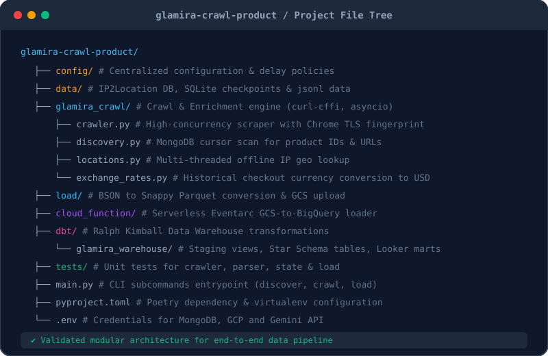
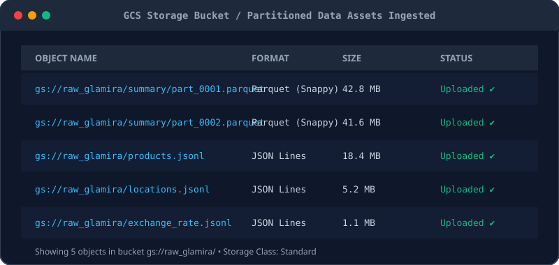
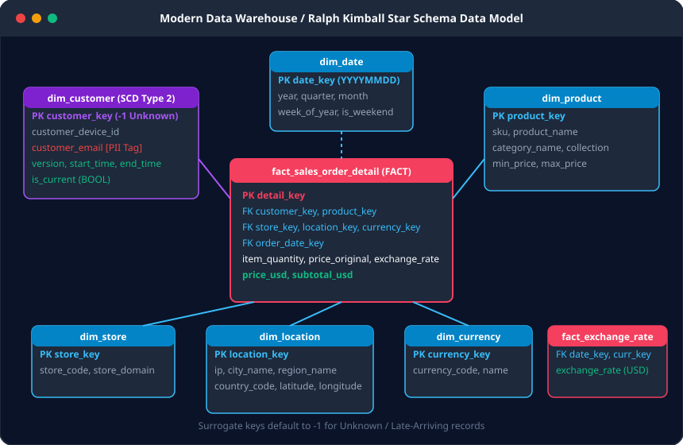
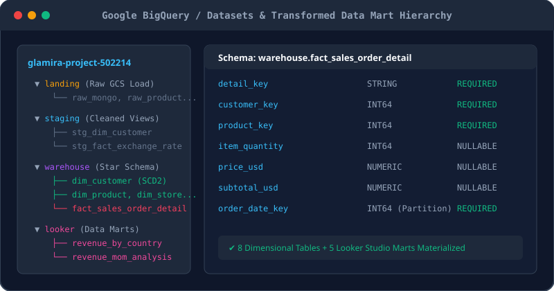
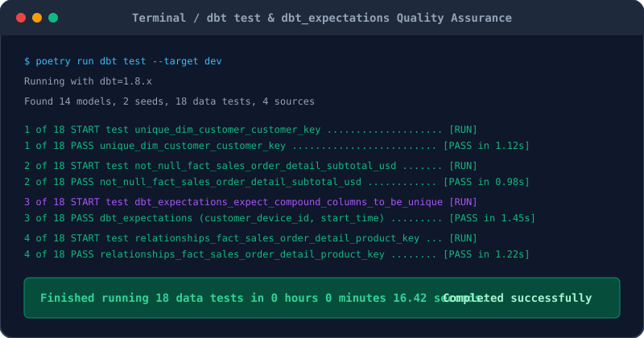
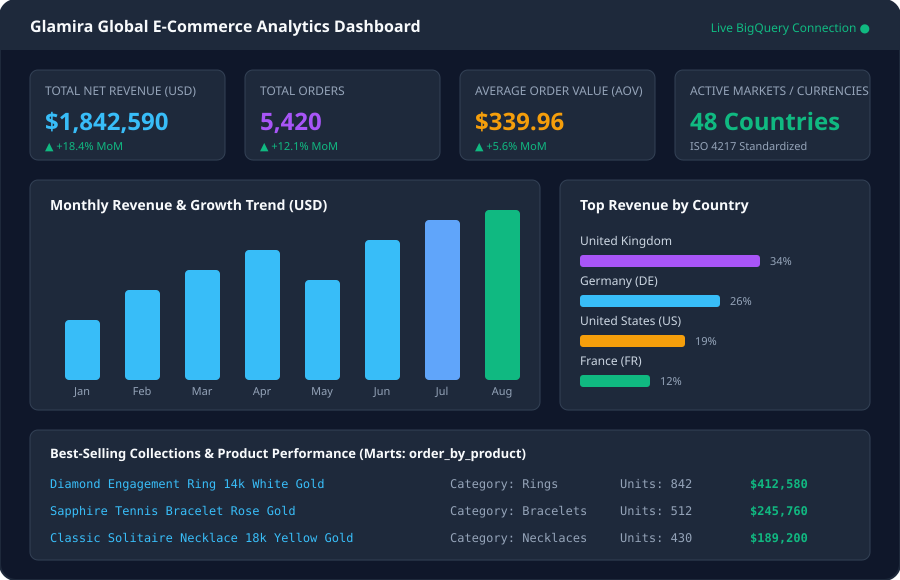

# Data Pipeline with dbt, BigQuery, Cloud Functions, and Looker Studio on GCP

This project demonstrates how to build and automate an end-to-end ELT data pipeline and Modern Data Warehouse for the international e-commerce platform Glamira. There are different tools that have been used in this project such as MongoDB (for extracting raw unstructured clickstream events), Python with curl-cffi and Asyncio (a high-performance scraper mimicking Chrome TLS fingerprints to enrich missing product catalog data), IP2Location & Frankfurter API (for offline IP geolocation lookup and historical multi-currency exchange rates), Google Cloud Storage (as a Data Lake storing Snappy-compressed Parquet and JSONL files), Google Cloud Functions (serverless event-driven ingestion into BigQuery), dbt (used for Ralph Kimball Star Schema data modeling, SCD Type 2 customer history tracking, and testing), and Google Looker Studio for executive BI dashboards.

# Project Goals - To try new tools and learn!
0. There has been a deluge of new tools and technologies in the market accentuating the modern data engineering field, and the best way to keep abreast is to pry them out and do hands-on engineering! In an enterprise e-commerce platform like Glamira—operating across dozens of countries, languages, and currencies—data often arrives in unstructured, nested JSON streams with missing product attributes, heterogeneous data types, and currency mismatches. In this project, we tackle these challenges head-on to design and orchestrate a resilient, scalable, and production-grade Modern Data Warehouse.

1. **Data Discovery & Catalog Enrichment** - Extract raw user tracking events from MongoDB and crawl product attributes (SKU, title, category, material, gold weight, pricing) using an asynchronous crawler equipped with Chrome TLS fingerprints.
2. **Data Geocoding & Multi-Currency Normalization** - Resolve user IP addresses into geographic locations (country, region, city, coordinates) via offline IP2Location DB and fetch historical checkout exchange rates into USD using Frankfurter API combined with Gemini AI currency mapping.
3. **Data Lake Storage (GCS)** - Resolve heterogeneous BSON leaf types into uniform strings, serialize clickstream data into Snappy-compressed Apache Parquet format, and upload partitions to Google Cloud Storage.
4. **Serverless Data Loading** - Automate event-driven data ingestion from GCS into Google BigQuery Landing datasets via serverless Google Cloud Functions.
5. **Data Transformation & Dimensional Modeling** - Use dbt to transform raw data into a Ralph Kimball Star Schema (Fact & Dimension tables) with Slowly Changing Dimensions (SCD Type 2) tracking customer evolution.
6. **Data Quality & Governance** - Implement comprehensive schema validation using `dbt test` and `dbt_expectations`, while safeguarding sensitive customer data (PII) using BigQuery Data Catalog Policy Tags.
7. **Business Intelligence & Reporting** - Build analytical Data Marts and connect them to Google Looker Studio to visualize executive KPIs, sales by country, and Month-over-Month (MoM) revenue growth.


# Data Architecture

The architecture (Data flow) used in this project uses different tools, serverless cloud components, and modern analytics frameworks:

<p align="center">
  
  <h6 align = "center" > Source: Author </h6>
</p>


# Dataset Used 

The data in this project is sourced from the global storefront of **Glamira**, an international luxury jewelry and accessories retailer. Glamira manages dozens of localized country storefronts (`glamira.co.uk`, `glamira.de`, `glamira.com`, etc.) accepting multiple local fiat currencies (USD, EUR, GBP, AUD, SGD, etc.).

1. **Clickstream Event Logs (MongoDB `countly.summary`)**:
   - Contains high-volume, semi-structured interaction logs: product detail views, custom option selections (alloys, gemstones, carats, engravings), add-to-cart events, and completed orders (`checkout_success`).
   - MongoDB documents are heavily nested, with sparse keys and heterogeneous leaf types.

2. **Catalog Metadata (Web Scraping)**:
   - Event logs only carry bare `product_id` numbers. Detailed attributes (`sku`, `product_name`, `gold_weight`, `collection`, `category_name`, `min_price`, `max_price`) are extracted directly from storefront URLs using TLS fingerprint-spoofing crawlers.

3. **Geographic & Currency Datasets**:
   - **IP Geolocation**: Sourced offline from the `IP2LOCATION-LITE-DB5.BIN` database.
   - **Exchange Rates**: Daily rates fetched against USD from the Frankfurter API for all checkout transaction timestamps.


# Tools and technologies used in this project

1. **BigQuery (GCP)** - BigQuery is a fully managed, serverless enterprise data warehouse offered by Google Cloud Platform. It provides high-speed SQL queries across terabyte-scale datasets and separates compute from storage, making it the ideal analytical backbone for our Landing, Staging, Warehouse, and Mart layers.
2. **Google Cloud Storage (GCS)** - GCS serves as our scalable object store and Data Lake. It securely retains all raw historical snapshots, partitioned Snappy Parquet files, and JSONL enrichment data before warehouse ingestion.
3. **Google Cloud Functions (2nd Gen)** - A lightweight, event-driven serverless compute platform. We deploy Cloud Functions to listen to GCS `object.v1.finalized` events through Eventarc, executing idempotent loading jobs into BigQuery without running continuous compute instances.
4. **dbt (Data Build Tool)** - dbt is an open-source transformation workflow engine that enables data teams to build, test, and document data models using standard SQL and software engineering best practices (version control, CI/CD, modularity).
5. **MongoDB & PyMongo** - A distributed NoSQL document database storing real-time user event streams. PyMongo is used with cursor batching and checkpoint state tracking for incremental extraction.
6. **curl-cffi & Asyncio** - An asynchronous Python crawling framework utilizing `curl-cffi` to mimic genuine Google Chrome TLS/JA3/HTTP2 fingerprints, safely bypassing Cloudflare and anti-bot protection mechanisms without getting rate-limited.
7. **IP2Location** - High-speed offline IP intelligence database (`LITE-DB5`) used to geolocate customer IPs into country ISO codes, city names, and coordinates without recurring API costs or network latency.
8. **Frankfurter API & Gemini AI** - Free financial foreign exchange rate API used to normalize all global checkout revenues into base currency (USD). Google's Gemini AI model is utilized to map dirty, raw currency strings to standard ISO 4217 currency codes.
9. **Google Looker Studio** - A cloud-native Business Intelligence and dashboard visualization tool directly integrated with BigQuery Data Marts for interactive executive analytics.
10. **Poetry & Python 3.11** - A modern Python dependency management and packaging tool that eliminates dependency conflicts by enforcing strict lockfiles and isolated virtual environments.
11. **Git Version Control** - Distributed version control to track project iterations, dbt schemas, and infrastructure code.


# Implementation

* **Step 1** - Project Environment Setup, Virtual Environments, and GCP Connection.

  To guarantee dependency isolation between the data crawler, data loader, and dbt transformation models, we structure the workspace into modular packages managed with Poetry:

<p align="center">
  
  <h6 align = "center" > Source: Author </h6>
</p>

  After cloning the repository, install dependencies using Poetry:
  ```bash
  # 1. Install crawler and pipeline core dependencies
  poetry install

  # 2. Install dbt-bigquery dependencies
  cd dbt
  poetry install
  cd glamira_warehouse && poetry run dbt deps && cd ../..
  ```

  To connect our local machine and the cloud pipeline with Google Cloud Platform, we create a Service Account in GCP IAM with the roles **Storage Admin** and **BigQuery Admin**, and download its JSON credentials key:

<p align="center">
  
  <h6 align = "center" > Source: Author </h6>
</p>

  Configure the project secrets in `.env`:
  ```env
  # MongoDB Source
  MONGODB_URI=mongodb://<HOST>:27017/?authSource=admin
  MONGODB_USERNAME=your_username
  MONGODB_PASSWORD=your_password
  MONGODB_AUTH_SOURCE=admin

  # Google Cloud Platform
  GOOGLE_APPLICATION_CREDENTIALS=config/service-account-key.json
  GCP_PROJECT_ID=glamira-project-502214

  # Gemini API (for currency seed mapping)
  GEMINI_API_KEY=your_gemini_api_key
  ```

  And configure `~/.dbt/profiles.yml` for dbt BigQuery connection:
  ```yaml
  glamira_warehouse:
    target: dev
    outputs:
      dev:
        type: bigquery
        method: service-account
        keyfile: config/service-account-key.json
        project: glamira-project-502214
        dataset: warehouse
        threads: 8
        location: asia-southeast1
        priority: interactive
  ```


* **Step 2** - Data Extraction, Web Scraping, Geocoding, and Upload to GCS.

  The data extraction pipeline performs incremental reading and multi-faceted enrichment:
  - **Discovery**: Scans MongoDB cursor for new `product_id` identifiers and storefront URLs:
    ```bash
    poetry run glamira-crawl discover
    ```
  - **Asynchronous Crawl**: Uses `curl-cffi` with connection pooling to scrape product titles, collections, materials, and prices:
    ```bash
    poetry run glamira-crawl crawl
    ```
  - **IP Geocoding & Currency Enrichment**: Looks up geographic locations and historical USD exchange rates:
    ```bash
    poetry run glamira-crawl locations --workers 16
    poetry run glamira-crawl exchange-rates
    ```
  - **Parquet Export & GCS Upload**: MongoDB leaf nodes are cast to uniform string types to prevent BigQuery schema mismatch errors, converted into Snappy-compressed Parquet files, and pushed to GCS:
    ```bash
    poetry run glamira-crawl load
    ```

<p align="center">
  
  <h6 align = "center" > Source: Author </h6>
</p>


* **Step 3** - Serverless Ingestion to BigQuery Landing via Cloud Functions.

  Whenever a file is uploaded to the Google Cloud Storage bucket (`gs://raw_glamira/`), an Eventarc trigger activates our serverless Google Cloud Function (`trigger_bigquery_load`).
  
  The function computes an idempotent Job ID based on the file hash to prevent duplicate loads, starts a BigQuery Load Job, and inserts raw data into the `landing` dataset (`raw_mongo`, `raw_product`, `raw_location`, `raw_exchange_rate`):

<p align="center">
  
  <h6 align = "center" > Source: Author </h6>
</p>

  Cloud Function implementation snippet (`cloud_function/main.py`):
  ```python
  import functions_framework
  from google.cloud import bigquery

  client = bigquery.Client()

  @functions_framework.cloud_event
  def trigger_bigquery(cloud_event):
      data = cloud_event.data
      bucket = data["bucket"]
      file_name = data["name"]

      if not (file_name.endswith(".parquet") or file_name.endswith(".jsonl")):
          return

      # Generate idempotent BigQuery Load Job configuration
      job_config = bigquery.LoadJobConfig(
          source_format=bigquery.SourceFormat.PARQUET if file_name.endswith(".parquet") 
                        else bigquery.SourceFormat.NEWLINE_DELIMITED_JSON,
          write_disposition=bigquery.WriteDisposition.WRITE_APPEND,
      )
      uri = f"gs://{bucket}/{file_name}"
      table_id = f"{client.project}.landing.raw_mongo"
      load_job = client.load_table_from_uri(uri, table_id, job_config=job_config)
      load_job.result()
      print(f"Loaded {load_job.output_rows} rows from {uri}")
  ```


* **Step 4** - Data Modeling with dbt (Ralph Kimball Star Schema & SCD Type 2).

  With raw data stored in BigQuery landing tables, we use dbt to execute modern dimensional transformations:
  - **Staging Layer (`staging`)**: Views that cleanse strings, unnest nested arrays, parse timestamps, and handle edge-case deduplication (such as multi-domain store conflicts and weekend currency fallbacks).
  - **Warehouse Layer (`warehouse`)**: Implements Ralph Kimball's Dimensional Modeling into an analytical **Star Schema**.

<p align="center">
  
  <h6 align = "center" > Source: Author </h6>
</p>

  **Key Features of the Dimensional Model:**
  - **Fact Table (`fact_sales_order_detail`)**: Contains the grain of individual line items purchased during checkout. Stores foreign surrogate keys, units sold, original transaction prices, daily exchange rate, and normalized total values (`price_usd`, `subtotal_usd`).
  - **SCD Type 2 Customer Dimension (`dim_customer`)**: Tracks changes in customer profiles (device ID, user DB ID, email, user agents) over time using `start_time`, `end_time`, `customer_version_number`, and `is_current` flags.
  - **Surrogate Key Handling**: Unknown or late-arriving dimensions are defaulted to surrogate key `-1`.

  To run the dbt models and materialize all tables in BigQuery:
  ```bash
  cd dbt/glamira_warehouse
  poetry run dbt seed
  poetry run dbt run
  ```

  After running dbt, all Staging views, Star Schema tables, and Looker Marts are cleanly organized in BigQuery:

<p align="center">
  
  <h6 align = "center" > Source: Author </h6>
</p>


* **Step 5** - Data Quality Assurance, dbt Expectations, and Data Governance.

  Data quality is the linchpin of any production data warehouse. In this step, we implement automated testing using `dbt test` and the `dbt_expectations` package:
  - **Not-Null & Uniqueness**: Validates that all primary surrogate keys across Fact and Dimension tables contain no nulls or duplicates.
  - **Compound Column Uniqueness (`dbt_expectations`)**: Ensures that each customer version in the SCD Type 2 table has a distinct `(customer_device_id, start_time)` timestamp pair:
    ```yaml
    - dbt_expectations.expect_compound_columns_to_be_unique:
        column_list: ["customer_device_id", "start_time"]
        row_condition: "customer_key != -1"
    ```
  - **Referential Integrity**: Guarantees that all foreign keys in `fact_sales_order_detail` link to valid surrogate keys in `dim_product`, `dim_customer`, `dim_store`, `dim_location`, and `dim_currency`.
  - **PII Data Governance**: Sensitive customer email addresses (`customer_email_address`) are tagged with BigQuery Data Catalog **Policy Tags** (`cus_email`), enforcing column-level encryption and access control.

  Execute all test suites with:
  ```bash
  poetry run dbt test
  ```

<p align="center">
  
  <h6 align = "center" > Source: Author </h6>
</p>


* **Step 6** - Business Intelligence & Executive Dashboard with Google Looker Studio.

  In the final stage, we build dedicated Data Mart tables inside the `looker` dataset:
  - `revenue_by_country`: Aggregates total order value, volume, and Average Order Value (AOV) per country.
  - `revenue_mom_analysis`: Computes monthly revenue growth and Month-over-Month (MoM) growth rates.
  - `order_by_product`: Identifies best-selling jewelry collections, metals (gold, silver), and gemstone variations.
  - `revenue_aov_customer_analysis`: Evaluates customer lifetime value and purchase frequency.

  We connect Google Looker Studio directly to BigQuery to visualize executive sales metrics:

<p align="center">
  
  <h6 align = "center" > Source: Author </h6>
</p>


**The End**
