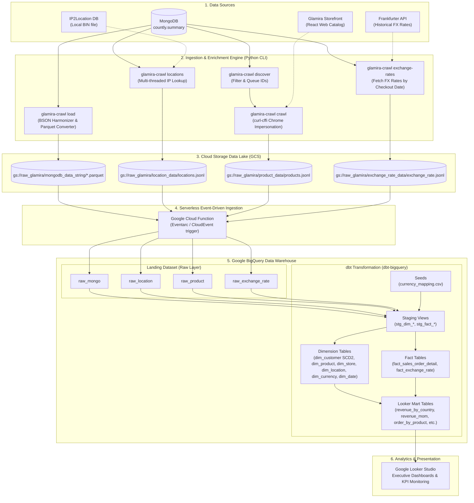

# Glamira End-to-End E-Commerce Data Pipeline & Analytics Warehouse

> **Một giải pháp dữ liệu toàn diện (End-to-End ELT & Data Warehouse) cho nền tảng thương mại điện tử trang sức quốc tế Glamira:** Từ việc crawl dữ liệu sản phẩm, trích xuất clickstream event từ MongoDB, làm giàu dữ liệu vị trí (IP Geolocation) & tỷ giá hối đoái lịch sử, tự động nạp vào Data Lakehouse trên Google Cloud Platform (GCS & BigQuery) thông qua Cloud Functions, đến mô hình hóa Star Schema với SCD Type 2 bằng dbt và trực quan hóa các chỉ số kinh doanh trên Looker Studio.

---

## 1. Project Name

**Glamira E-Commerce Data Pipeline & Analytics Warehouse**  
*(Mã dự án: `glamira-crawl-product` / `glamira-pipeline-python-mongo-gcs-bigquery-looker`)*

- **Core Tech Stack:** Python 3.11, MongoDB, curl-cffi, IP2Location, PyArrow/Parquet, Google Cloud Storage (GCS), Google Cloud Functions, Google BigQuery, dbt (dbt-bigquery, dbt_expectations), Google Looker Studio, Gemini API.

---

## 2. About - Mô tả bài toán project đang giải quyết

### 2.1. Bối cảnh
Glamira là thương hiệu trang sức và phụ kiện cao cấp hoạt động trên quy mô toàn cầu với mạng lưới cửa hàng trực tuyến đa quốc gia, đa tiền tệ và hàng triệu lượt tương tác mỗi ngày. Toàn bộ hành vi người dùng (clickstream tracking bao gồm xem sản phẩm, chọn cấu hình chất liệu/đá quý, thêm vào giỏ hàng, checkout thành công...) được hệ thống Countly thu thập và ghi nhận dưới dạng JSON/BSON document không cấu trúc trong MongoDB (`countly.summary`).

### 2.2. Vấn đề thực tế (Pain Points)
1. **Dữ liệu sản phẩm bị phân mảnh và thiếu chiều sâu catalog:**
   - Trong logs MongoDB, các sự kiện chỉ ghi nhận `product_id` hoặc URL tracking cơ bản. Các thông tin quan trọng của ngành trang sức như: SKU, chất liệu kim loại (vàng, bạc, bạch kim), trọng lượng kim loại (`gold_weight`, `fixed_silver_weight`), loại đá, bộ sưu tập (`collection`), danh mục (`category`), giá gốc và giá cấu hình đều nằm ở storefront web và không có trong database sự kiện.
2. **Dữ liệu hành vi thô thiếu thông tin phân tích:**
   - Vị trí khách hàng chỉ ghi nhận địa chỉ IP thô (`ip`), thiếu các chiều địa lý chuẩn xác (thành phố, khu vực, quốc gia, tọa độ GPS).
   - Giao dịch thanh toán (`checkout_success`) diễn ra trên nhiều loại tiền tệ địa phương khác nhau (EUR, USD, GBP, SGD, CHF, CAD...). Thiếu thông tin chuẩn hóa mã tiền tệ quốc tế ISO 4217 và tỷ giá quy đổi USD tại đúng ngày phát sinh đơn hàng.
3. **Thách thức về kiểu dữ liệu và hiệu năng truy vấn trên MongoDB (NoSQL):**
   - Tài liệu MongoDB có cấu trúc nested đa tầng, schema không cố định (heterogeneous leaf data types: lúc là số, chuỗi, boolean hoặc mảng) gây lỗi nghiêm trọng khi nạp trực tiếp vào các hệ thống OLAP dạng cột.
   - Không thể thực hiện các phân tích phức tạp, các truy vấn tổng hợp đa chiều (OLAP), phân tích tăng trưởng doanh thu theo tháng (MoM), giá trị đơn hàng trung bình (AOV), phân tích hành vi khách hàng trực tiếp trên database vận hành MongoDB mà không làm nghẽn hệ thống.
4. **Bảo mật và quyền riêng tư (PII Compliance):**
   - Cần bảo vệ thông tin nhận dạng cá nhân của khách hàng (`customer_email_address`, `customer_user_id_db`) theo các tiêu chuẩn GDPR / data privacy bằng cơ chế Column-level Access Control (Policy Tags).

### 2.3. Giải pháp của dự án
Project cung cấp một Data Platform hoàn chỉnh giải quyết triệt để các vấn đề trên:
- **Crawler & Enricher:** Sử dụng `curl-cffi` mô phỏng TLS/HTTP2 fingerprint của trình duyệt Chrome để bypass anti-bot, tự động bóc tách thông tin cấu hình sản phẩm từ Glamira React Storefront; làm giàu tọa độ/địa danh từ IP qua database offline `IP2Location`; tự động gọi Frankfurter API lấy tỷ giá hối đoái lịch sử theo từng ngày phát sinh checkout; dùng Gemini AI để mapping chuẩn hóa các chuỗi tiền tệ thô sang chuẩn ISO 4217.
- **Robust ELT Pipeline:** Xuất dữ liệu MongoDB sang định dạng Apache Parquet theo batch tối ưu hóa bộ nhớ, chuẩn hóa schema kiểu dữ liệu lá (leaf nodes) và đẩy tự động lên GCS Data Lake.
- **Event-Driven Ingestion:** Google Cloud Function (CloudEvent) lắng nghe sự kiện tạo file trên GCS và tự động nạp vào BigQuery Landing tables mà không cần can thiệp thủ công.
- **Dimensional Modeling (Star Schema & SCD2):** Sử dụng `dbt` để transform từ Landing $\to$ Staging $\to$ Warehouse:
  - Bảng Fact: `fact_sales_order_detail` (hợp nhất sản phẩm, tiền tệ, tỷ giá, doanh thu quy đổi USD), `fact_exchange_rate`.
  - Bảng Dimension: `dim_customer` (áp dụng Slowly Changing Dimension Type 2 theo `customer_device_id` có theo dõi lịch sử thay đổi user-agent/email), `dim_product`, `dim_store`, `dim_location`, `dim_currency`, `dim_date`.
- **Business Intelligence & Reporting:** Tầng Looker Data Mart sẵn sàng kết nối với Google Looker Studio cung cấp báo cáo doanh thu theo quốc gia, báo cáo tăng trưởng MoM, AOV theo phân khúc và xu hướng đơn hàng theo tuần.

---

## 3. Architecture

### 3.1. Luồng kiến trúc tổng thể (Architecture Diagram)



### 3.2. Cấu trúc mô hình dữ liệu (Star Schema & Kimball Modeling)

- **`dim_customer` (SCD Type 2):**  
  Theo dõi lịch sử thay đổi của khách hàng theo `customer_device_id` (business key), quản lý `customer_version_number`, `start_time`, `end_time`, và cờ `is_current`. Cột `customer_email_address` được bảo mật bằng Policy Tag phân quyền xem PII.
- **`dim_product`:**  
  Lưu thông tin chi tiết sản phẩm được crawl: `sku`, `attribute_set`, `price`, `gold_weight`, `fixed_silver_weight`, `material_design`, `collection`, `category_name`, v.v.
- **`dim_store` & `dim_currency`:**  
  Chuẩn hóa mã cửa hàng, domain quốc gia, và mapping mã tiền tệ chuẩn ISO 4217 (được sinh tự động với sự hỗ trợ của Gemini API).
- **`dim_location`:**  
  Lưu thông tin vị trí địa lý của địa chỉ IP: quốc gia, mã quốc gia ISO, vùng/bang, thành phố, vĩ độ và kinh độ.
- **`dim_date`:**  
  Bảng chiều ngày với các thuộc tính thời gian phục vụ phân tích (năm, quý, tháng, tuần, ngày trong tuần).
- **`fact_sales_order_detail` (Grain: từng item trong đơn hàng):**  
  Bảng sự kiện giao dịch chi tiết từ sự kiện `checkout_success`, liên kết toàn bộ surrogate keys tới các bảng Dimension, tính toán giá trị gốc (`price_original`), tỷ giá quy đổi và doanh thu tính theo USD (`price_usd`, `subtotal_usd`).
- **`fact_exchange_rate`:**  
  Lưu tỷ giá hối đoái theo ngày giữa USD và các đồng tiền thanh toán.

---

## 4. Installation

### 4.1. Yêu cầu hệ thống (Prerequisites)
- **Hệ điều hành:** Linux, macOS, hoặc Windows (khuyến nghị Windows 10/11 hoặc Ubuntu 22.04 LTS).
- **Python:** Phiên bản $\ge$ 3.11.
- **Poetry:** Quản lý môi trường và thư viện Python (`pip install poetry`).
- **Google Cloud SDK (`gcloud` CLI):** Đã đăng nhập và cấp quyền vào dự án GCP (`glamira-project-502214`).
- **MongoDB:** Quyền truy cập vào cụm MongoDB chứa database `countly` và collection `summary`.
- **IP2Location Database:** File cơ sở dữ liệu nhị phân `IP2LOCATION-LITE-DB5.BIN` (tải từ trang chủ IP2Location).

### 4.2. Cài đặt các gói phụ thuộc (Dependencies)

Clone repository về máy:
```bash
git clone https://github.com/thanhklt/glamira-crawl-product.git
cd glamira-crawl-product
```

Cài đặt môi trường Python cho Pipeline chính:
```bash
poetry install
```

Cài đặt môi trường Python cho dbt Data Warehouse:
```bash
cd dbt
poetry install
cd ..
```

Cài đặt các gói dbt packages (`dbt_expectations`):
```bash
cd dbt/glamira_warehouse
poetry run dbt deps
cd ../..
```

Tải và chuẩn bị file IP2Location DB:
- Đặt file `IP2LOCATION-LITE-DB5.BIN` vào thư mục `data/`:
```bash
# Kiểm tra file đã tồn tại
ls data/IP2LOCATION-LITE-DB5.BIN
```

---

## 5. Development Setup

### 5.1. Thiết lập biến môi trường (`.env`)

Tạo file `.env` tại thư mục gốc của dự án với các thông số sau:

```env
# MongoDB Credentials
MONGODB_URI=mongodb://<IP_OR_HOST>:27017/?authSource=admin
MONGODB_USERNAME=your_username
MONGODB_PASSWORD=your_password
MONGODB_AUTH_SOURCE=admin

# Google Cloud Platform Credentials
GOOGLE_APPLICATION_CREDENTIALS=/path/to/service_account_key.json
GCP_PROJECT_ID=glamira-project-502214

# Gemini API Key (dùng cho script mapping currency chuẩn hóa)
GEMINI_API_KEY=your_gemini_api_key
```

### 5.2. Cấu hình hệ thống (`config/config.yml`)

File [config/config.yml](file:///d:/Workspace/glamira-crawl-product/config/config.yml) cho phép tinh chỉnh các thông số vận hành:
- `crawler.concurrency`: Số worker crawl song song (mặc định: `10`).
- `crawler.request_delay_seconds` & `request_jitter_seconds`: Thời gian trễ ngẫu nhiên giữa các request để tránh bị khóa IP.
- `crawler.curl_impersonate`: Phiên bản TLS fingerprint cần mô phỏng (ví dụ: `chrome`).
- `load.documents_per_file`: Số lượng bản ghi nạp vào mỗi file Parquet (mặc định: `10000`).
- `load.gcs_bucket` & `gcs_prefix`: Bucket đích trên Cloud Storage (`raw_glamira`).

### 5.3. Cấu hình dbt Profile

Đảm bảo file `~/.dbt/profiles.yml` đã được định cấu hình kết nối tới BigQuery:

```yaml
glamira_warehouse:
  target: dev
  outputs:
    dev:
      type: bigquery
      method: oauth # hoặc service-account
      project: glamira-project-502214
      dataset: warehouse
      threads: 8
      location: asia-southeast1
      priority: interactive
```

### 5.4. Quy trình chạy toàn bộ Pipeline (Execution Workflow)

Pipeline có thể được thực thi tuần tự theo các bước hoặc bằng lệnh tổng hợp:

#### Bước 1: Khám phá danh sách sản phẩm cần crawl từ MongoDB
```bash
poetry run glamira-crawl discover
```
*Lệnh này quét collection `summary`, trích xuất các `product_id` và URL xuất hiện trong các sự kiện xem/thêm giỏ hàng, lưu hàng đợi vào SQLite state DB (`data/crawl-state.sqlite3`).*

#### Bước 2: Crawl thông tin sản phẩm từ storefront Glamira
```bash
poetry run glamira-crawl crawl
# Hoặc thử lại các URL lỗi:
poetry run glamira-crawl crawl --retry-failed
```

#### Bước 3: Xuất tọa độ và địa danh từ danh sách IP
```bash
poetry run glamira-crawl locations --workers 16
```
*Trích xuất danh sách IP duy nhất từ MongoDB và tra cứu qua `IP2Location`, xuất ra `data/locations.jsonl`.*

#### Bước 4: Lấy tỷ giá hối đoái cho các ngày checkout
```bash
poetry run glamira-crawl exchange-rates
```
*Quét ngày giao dịch thành công trong MongoDB, tải tỷ giá USD từ Frankfurter API và xuất ra `data/exchange_rate.jsonl`.*

#### Bước 5: Nạp dữ liệu lên Google Cloud Storage (GCS)
```bash
poetry run glamira-crawl load
```
*Tự động trích xuất các batch dữ liệu từ MongoDB sang Parquet, upload lên `gs://raw_glamira/mongodb_data_string/` và upload các file JSONL phụ trợ lên GCS.*

#### Bước 6: Kiểm tra Google Cloud Function & BigQuery Landing
Khi các file mới được tải lên GCS, Cloud Function sẽ tự động kích hoạt Load Job để nạp vào BigQuery dataset `landing`:
- `raw_mongo` (Parquet)
- `raw_location` (JSONL)
- `raw_product` (JSONL)
- `raw_exchange_rate` (JSONL)

*(Có thể kích hoạt nạp thủ công bằng script [load/load_to_bigquery.py](file:///d:/Workspace/glamira-crawl-product/load/load_to_bigquery.py))*

#### Bước 7: Thực thi dbt Transformations & Data Quality Tests
```bash
cd dbt/glamira_warehouse

# 1. Nạp seed data (mapping tiền tệ chuẩn ISO)
poetry run dbt seed

# 2. Build toàn bộ mô hình (Staging, Warehouse, Looker Data Mart)
poetry run dbt run

# 3. Kiểm tra tính toàn vẹn dữ liệu (Data Quality Tests & Expectations)
poetry run dbt test
```

---

## 6. Known Issues

Trong quá trình vận hành và xử lý dữ liệu, hệ thống có một số vấn đề đã ghi nhận và phương án xử lý như sau:

1. **Trùng lặp Domain giữa các Store ID (`store_domain` trùng trên nhiều `store_id`):**
   - Trong dữ liệu tracking của Glamira, một tên miền (ví dụ: `glamira.de`, `glamira.com`) có thể gắn với nhiều mã `store_id` hoặc ngược lại do kiến trúc multi-store và chuyển vùng tự động.
   - *Giải pháp:* Tại mô hình `stg_dim_store.sql` và `dim_store.sql`, sử dụng cửa sổ `ROW_NUMBER() OVER (PARTITION BY store_id ...)` kết hợp với xử lý bản ghi fallback `store_id = -1` cho các trường hợp không xác định.

2. **Cơ chế chống bot (Cloudflare / WAF) và Rate Limiting của website Glamira:**
   - Việc gửi lượng lớn request đồng thời đến storefront có thể gặp phản hồi HTTP 403 (Forbidden) hoặc 429 (Too Many Requests).
   - *Giải pháp:* Sử dụng `curl-cffi` với chế độ `impersonate="chrome"`, thiết lập xoay vòng User-Agent, áp dụng cơ chế jitter delay ngẫu nhiên giữa các request, và tự động lưu các URL lỗi vào `failed-urls.jsonl` để thử lại có kiểm soát.

3. **Tính dị biệt kiểu dữ liệu (Schema Heterogeneity) trong BSON MongoDB:**
   - Một số trường trong document MongoDB lưu trữ kiểu dữ liệu không nhất quán qua các phiên bản app/web (ví dụ: cùng một trường có lúc là float, lúc là string số, lúc là array rỗng).
   - *Giải pháp:* Module `export_to_gcs.py` áp dụng hàm `normalize_bson()` ép toàn bộ giá trị lá (leaf nodes) về định dạng `String` trước khi chuyển thành Apache Parquet. Tầng dbt staging sử dụng các hàm `SAFE_CAST` khi chuyển đổi ngược về kiểu dữ liệu số/ngày.

4. **Ngày nghỉ giao dịch ngoại hối (Weekend & Holiday Exchange Rate Gap):**
   - Frankfurter API chỉ trả về tỷ giá vào các ngày giao dịch ngân hàng (thứ Hai đến thứ Sáu). Đơn hàng checkout vào thứ Bảy, Chủ Nhật hoặc ngày lễ quốc tế sẽ không có bản ghi tỷ giá trực tiếp của ngày đó.
   - *Giải pháp:* Tầng `stg_fact_exchange_rate.sql` và `fact_sales_order_detail.sql` áp dụng logic điền khuyết (fallback lấy tỷ giá của ngày làm việc gần nhất liền kề trước đó).

5. **Phân quyền truy cập dữ liệu nhạy cảm (PII Policy Tag):**
   - Cột `customer_email_address` trong `dim_customer` được gắn Policy Tag bảo mật dữ liệu PII trên BigQuery. Người dùng hoặc Service Account không có role `Data Catalog Fine-Grained Reader` khi truy vấn `SELECT * FROM dim_customer` sẽ gặp lỗi `Access Denied`. Cần cấp quyền thích hợp cho tài khoản kết nối Looker Studio.
